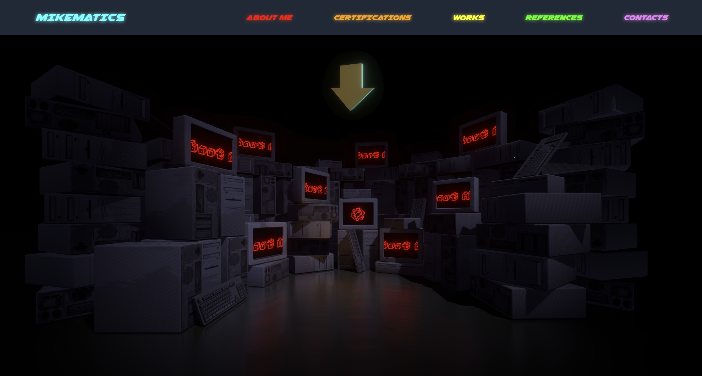

# Mikematics Portfolio
## Table of Contents
- [Description](#description)
- [Installation](#installation)
- [Usage](#usage)
- [License](#license)

## Description
My professional 3D portfolio site for viewing my works and contact information.

[](https://mikematics22800.github.io/Portfolio)

## Installation
```
cd $directory
git clone https://github.com/mikemedina22800/Mikematics-Portfolio
cd Mikematics-Portfolio
npm i 
```
## Usage
After installation, run `npm start` and open http://localhost:3000/Portfolio in your browser.

## Node Packages
React | React Three Fiber | React Three Drei | Tailwind CSS | Material UI 

## License
[](https://opensource.org/licenses/ISC)
